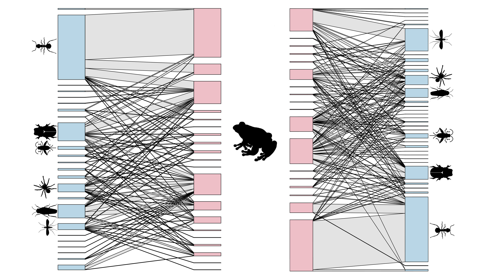

## Trophic Ecology 

### I'm interested in how trophic interactions are distributed both in space and time!

### My research is highly collaborative. Most of my publications have been done in close collaboration with colleagues in many institutions worldwide. I believe in a  collaborative and inclusive science to a changing world. 

---

> A lawn is a green salad for a sheep and a complex universe for an insect (Huston, 1994)

##### Karoline Ceron | <adenomera@gmail.com>  [![alt text][1.1]][1]  [![alt text][6.1]][6]
 
 [1.1]: http://i.imgur.com/tXSoThF.png (twitter icon with padding)
 
  [1]: http://www.twitter.com/ceronkarol 
  
  
  
  [6.1]: http://i.imgur.com/0o48UoR.png (github icon with padding)
 
 [6]: http://www.github.com/karolceron      

