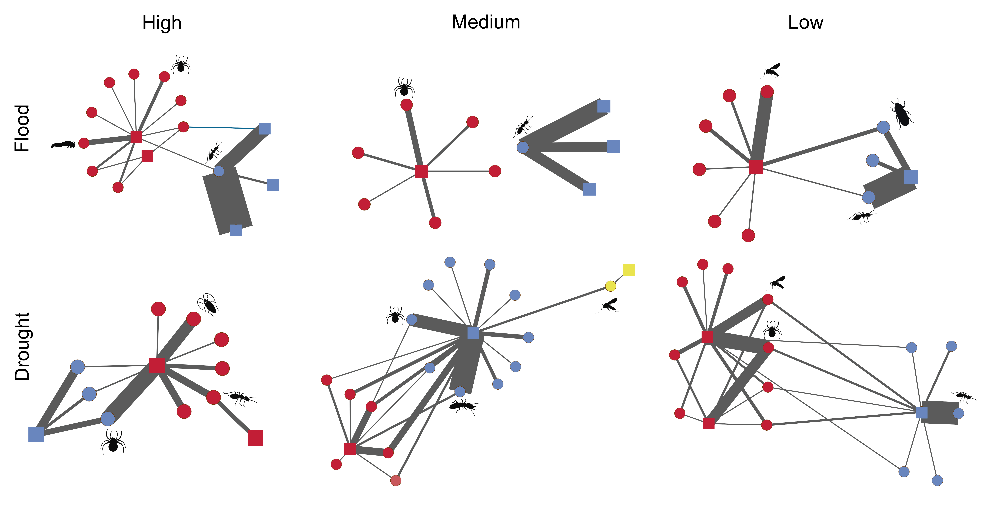

My name is Karoline Ceron and I am currently a PhD. candidate at the Federal University of Mato Grosso do Sul, Brazil. My current doctoral project involves anuran trophic ecology in several ecoregions in Brazil (Atlantic Forest, Chaco, Cerrado, and Pantanal). Since my bachelor’s degree, I am a proactive researcher, seeking to understand the processes that are molding communities and exploring the variables underlying these processes.
 |  

## Research Interests
Trophic ecology, Ecological networks, Metacommunity Dynamics, Natural history of Neotropical Herpetofauna

